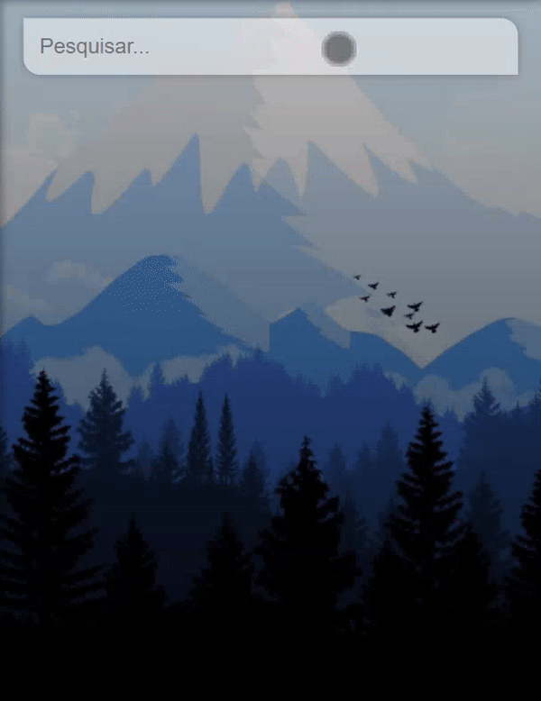

# vueJs-weather

O aplicativo utiliza a api do "OpenWeatherMap" para buscar a temperatura atual de um determinado local (inserido na UI).

## Project setup
```
npm install
```

### Compiles and hot-reloads for development
```
npm run serve
```

### App
